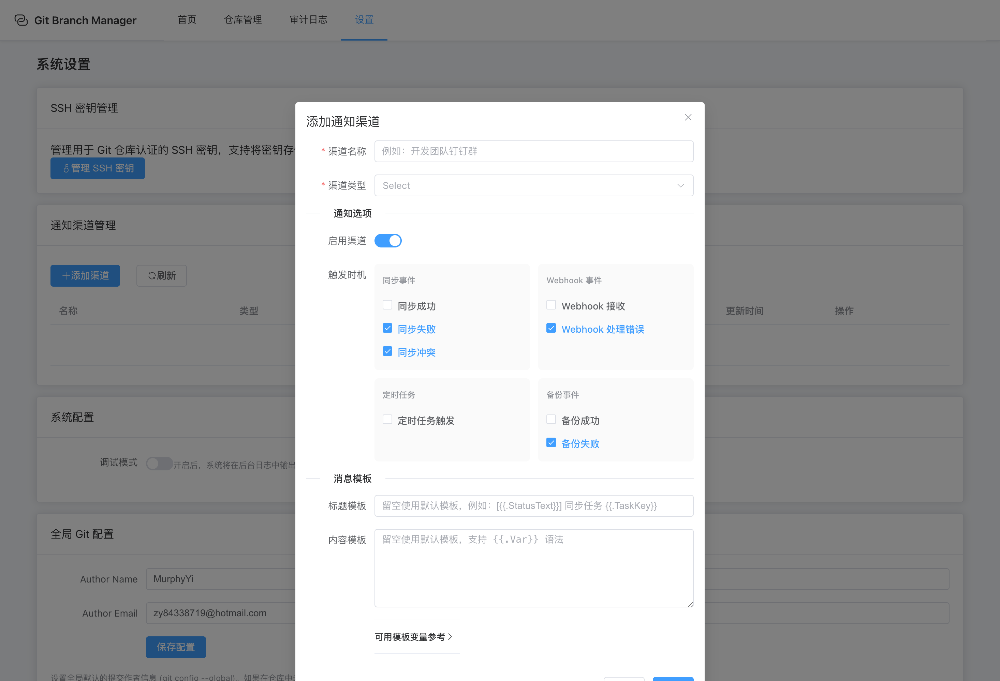

# Git Manage Service (Git 管理服务)

Git Manage Service 是一个轻量级的多仓库、多分支自动化同步管理系统。它提供了友好的 Web 界面，支持定时任务、Webhook 触发、多渠道消息通知以及详细的同步日志记录。


## 功能特性

- **多仓库管理** - 轻松注册和管理本地 Git 仓库
- **灵活同步规则** - 支持任意 Remote 和分支之间的同步（如 `origin/main` -> `backup/main`）
- **自动化执行** - 内置 Cron 调度器，支持定时同步
- **Webhook 集成** - 支持通过外部系统（如 CI/CD）触发同步
- **安全可靠** - 冲突检测、Fast-Forward 检查及 Force Push 保护
- **多渠道通知** - 支持钉钉、企业微信、飞书、蓝信、邮件、自定义 Webhook，按事件类型和自定义模板发送通知
- **消息模板** - 支持 Go 模板语法 `{{.Var}}`，每个渠道独立配置标题和内容模板
- **SSH 密钥管理** - 支持将 SSH 密钥存储在数据库中，统一管理仓库认证
- **多数据库支持** - 支持 SQLite（默认）、MySQL、PostgreSQL
- **高可用存储** - 可选 MinIO 对象存储，支持分布式 Redis 锁
- **可视化界面** - 提供直观的 Web UI，查看历史、日志及管理任务

## 界面预览

### 系统设置 - 通知渠道管理


### 通知渠道配置 - 触发时机与消息模板



支持 8 种触发事件：同步成功/失败/冲突、Webhook 接收/错误、定时任务触发、备份成功/失败。

### 自定义消息模板与变量参考


使用 Go 模板语法 `{{.Var}}`，提供 17 个模板变量，支持按渠道独立配置。留空则使用默认模板。

可用模板变量：

| 变量 | 说明 | 适用事件 |
|------|------|----------|
| `{{.TaskKey}}` | 任务标识 | 全部 |
| `{{.Status}}` | 状态码 (success/failure) | 全部 |
| `{{.StatusText}}` | 状态文字 (成功/失败) | 全部 |
| `{{.EventType}}` | 事件类型 | 全部 |
| `{{.EventLabel}}` | 事件名称 | 全部 |
| `{{.Timestamp}}` | 时间 | 全部 |
| `{{.SourceRemote}}` | 源远程仓库 | 同步事件 |
| `{{.SourceBranch}}` | 源分支 | 同步事件 |
| `{{.TargetRemote}}` | 目标远程仓库 | 同步事件 |
| `{{.TargetBranch}}` | 目标分支 | 同步事件 |
| `{{.RepoKey}}` | 仓库标识 | 全部 |
| `{{.ErrorMessage}}` | 错误信息 | 失败/错误/冲突 |
| `{{.CommitRange}}` | 提交范围 | 同步成功 |
| `{{.Duration}}` | 执行耗时 | 同步/备份 |
| `{{.CronExpression}}` | Cron 表达式 | 定时任务 |
| `{{.WebhookSource}}` | Webhook 来源 | Webhook 事件 |
| `{{.BackupPath}}` | 备份路径 | 备份事件 |

**模板示例：**
```
标题：[{{.StatusText}}] {{.TaskKey}} 同步通知
内容：任务 {{.TaskKey}} 于 {{.Timestamp}} 执行{{.StatusText}}
      {{.SourceRemote}}/{{.SourceBranch}} -> {{.TargetRemote}}/{{.TargetBranch}}
      耗时: {{.Duration}}
      {{if .ErrorMessage}}错误: {{.ErrorMessage}}{{end}}
```

## 文档

- [产品手册与使用说明](docs/product_manual.md)
- [Webhook 接口文档](docs/webhook.md)

## 快速开始

### 方式一：下载预编译二进制文件（推荐）

从 [Releases](https://github.com/yi-nology/git-manage-service/releases) 页面下载适合你系统的版本：

- **Linux (AMD64)**: `git-manage-service-linux-amd64.tar.gz`
- **Linux (ARM64)**: `git-manage-service-linux-arm64.tar.gz`
- **macOS (Intel)**: `git-manage-service-darwin-amd64.tar.gz`
- **macOS (Apple Silicon)**: `git-manage-service-darwin-arm64.tar.gz`
- **Windows (AMD64)**: `git-manage-service-windows-amd64.exe.zip`
- **Windows (ARM64)**: `git-manage-service-windows-arm64.exe.zip`

#### Linux / macOS
```bash
# 解压
tar -xzf git-manage-service-*.tar.gz

# 添加执行权限
chmod +x git-manage-service-*

# 运行
./git-manage-service-*
```

#### Windows
```powershell
# 解压 zip 文件
# 双击运行或在命令行中执行
.\git-manage-service-windows-amd64.exe
```

### 方式二：Docker Compose 部署

项目提供三种数据库方案的 Docker Compose 配置：

```bash
# SQLite（默认，最简单）
cd deploy/docker-compose/sqlite
docker-compose up -d

# MySQL（带 Redis + MinIO）
cd deploy/docker-compose/mysql
docker-compose up -d

# PostgreSQL（带 Redis + MinIO）
cd deploy/docker-compose/postgres
docker-compose up -d
```

> SQLite 方案适合单机部署，MySQL/PostgreSQL 方案带有 Redis 分布式锁和 MinIO 对象存储，适合高可用场景。

### 方式三：从源码编译
```bash
# 安装依赖
go mod tidy

# 编译前端
cd frontend && npm install && npm run build && cd ..

# 复制前端到 public 目录
cp -r frontend/dist public

# 编译
go build -o git-manage-service main.go

# 运行
./git-manage-service
```

### 访问界面
浏览器打开: [http://localhost:38080](http://localhost:38080)

### 查看版本信息
```bash
./git-manage-service --version
```

## 项目结构
```
.
├── biz/              # 业务逻辑 (Service, Handler, Model)
│   ├── handler/      # HTTP 请求处理
│   ├── service/      # 核心业务服务
│   │   ├── notification/  # 通知服务（模板引擎、多渠道发送）
│   │   ├── sync/          # 同步服务
│   │   ├── git/           # Git 操作封装
│   │   └── ...
│   ├── model/        # 数据模型 (PO, API, Proto)
│   ├── dal/          # 数据访问层
│   └── router/       # 路由注册
├── pkg/              # 公共库
│   ├── configs/      # 配置管理
│   ├── storage/      # 存储抽象层 (本地/MinIO)
│   └── lock/         # 分布式锁 (内存/Redis)
├── frontend/         # Vue 3 + Element Plus 前端
├── deploy/           # 部署配置 (Docker Compose, K8s)
├── docs/             # 项目文档
├── idl/              # Proto 接口定义
├── main.go           # 入口文件
└── go.mod            # Go 依赖定义
```

## 开发者指南

### 创建新版本发布

本项目使用 GitHub Actions 自动构建多平台二进制文件。要创建新的发布版本：

1. **创建版本标签**
```bash
# 创建并推送标签
git tag -a v1.0.0 -m "Release version 1.0.0"
git push origin v1.0.0
```

2. **自动构建**
   - GitHub Actions 会自动检测到标签推送
   - 自动构建 6 个平台的二进制文件：
     - Linux (AMD64/ARM64)
     - macOS (Intel/Apple Silicon)
     - Windows (AMD64/ARM64)
   - 自动创建 GitHub Release 并上传构建产物

3. **手动触发**（可选）
   - 访问 GitHub Actions 页面
   - 选择 "Release Build" 工作流
   - 点击 "Run workflow" 按钮手动触发

### 本地构建多平台版本

```bash
# Linux AMD64
GOOS=linux GOARCH=amd64 go build -o git-manage-service-linux-amd64 main.go

# Linux ARM64
GOOS=linux GOARCH=arm64 go build -o git-manage-service-linux-arm64 main.go

# macOS AMD64
GOOS=darwin GOARCH=amd64 go build -o git-manage-service-darwin-amd64 main.go

# macOS ARM64
GOOS=darwin GOARCH=arm64 go build -o git-manage-service-darwin-arm64 main.go

# Windows AMD64
GOOS=windows GOARCH=amd64 go build -o git-manage-service-windows-amd64.exe main.go

# Windows ARM64
GOOS=windows GOARCH=arm64 go build -o git-manage-service-windows-arm64.exe main.go
```

## License
MIT
