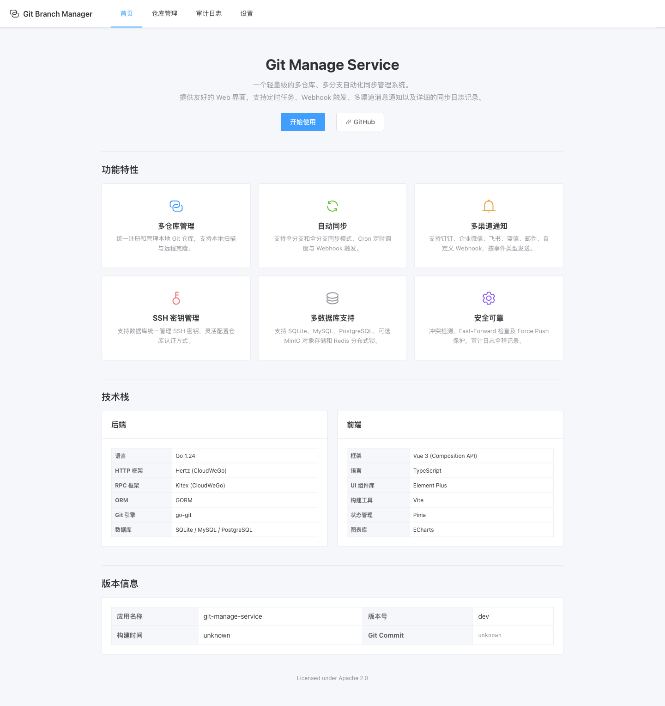
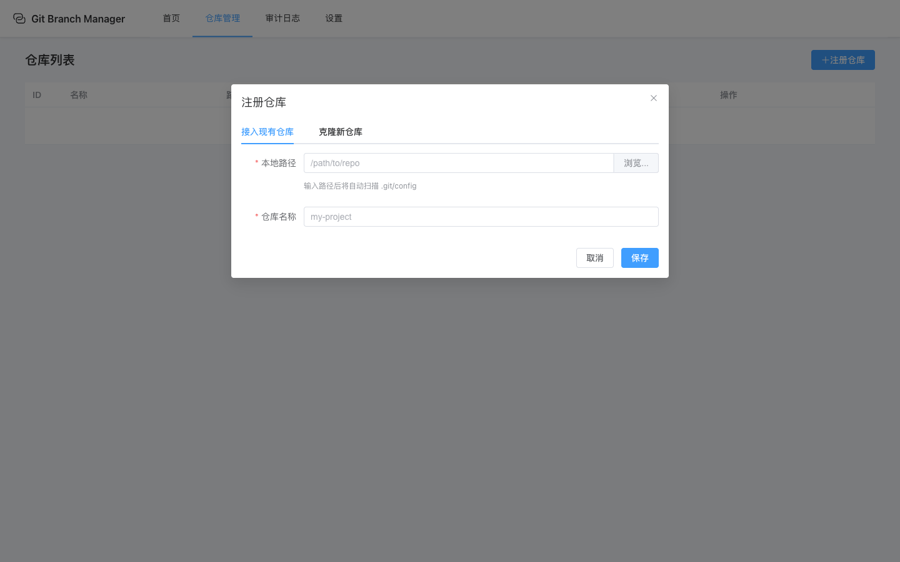
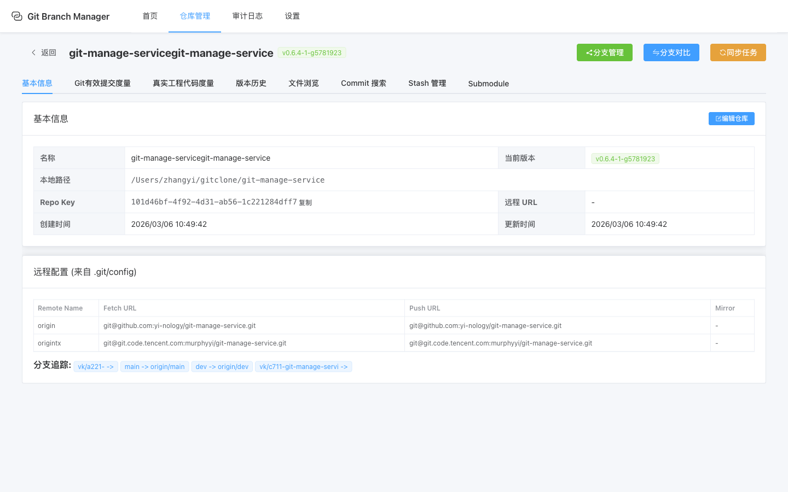
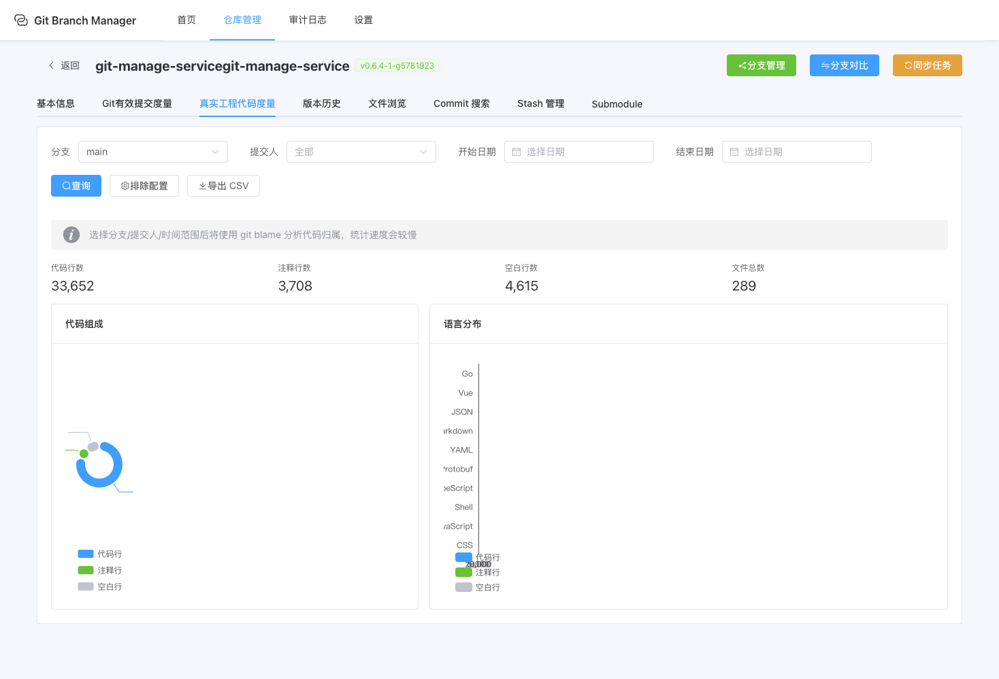
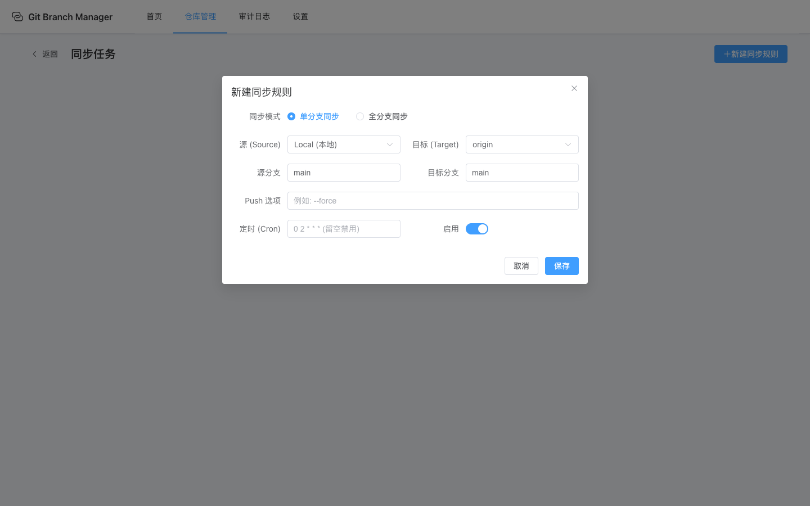
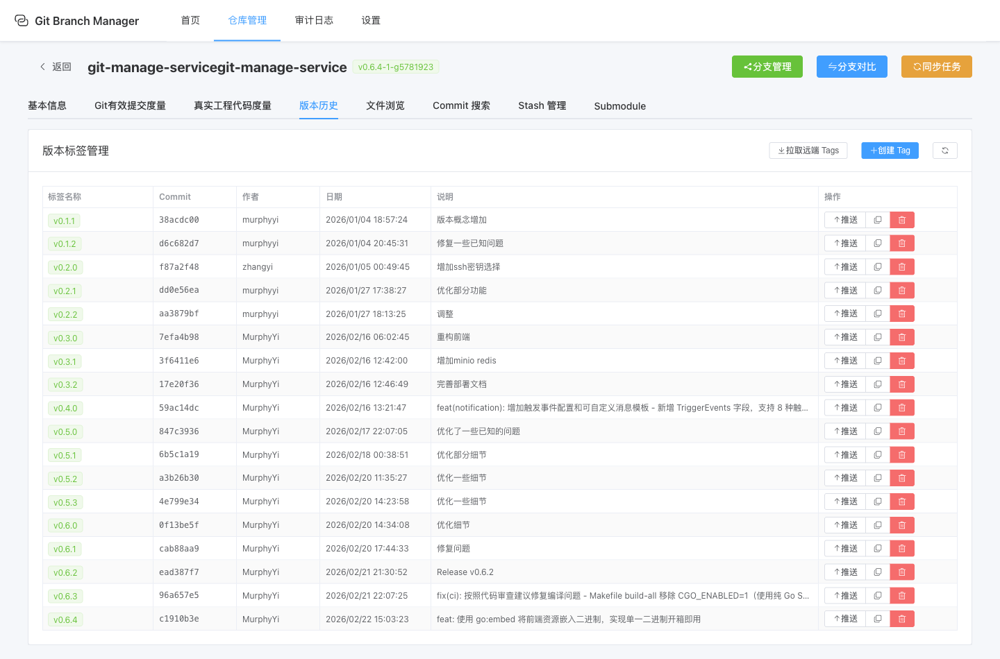
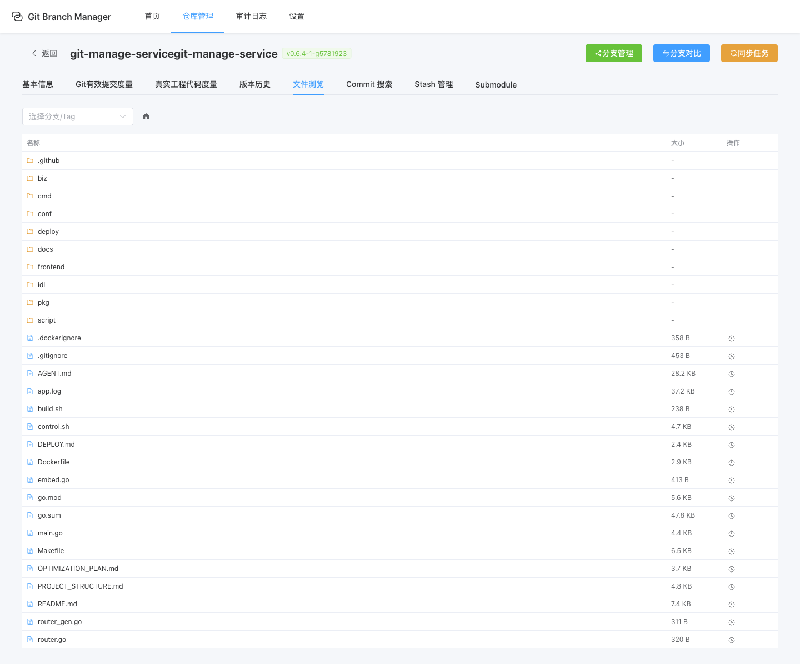
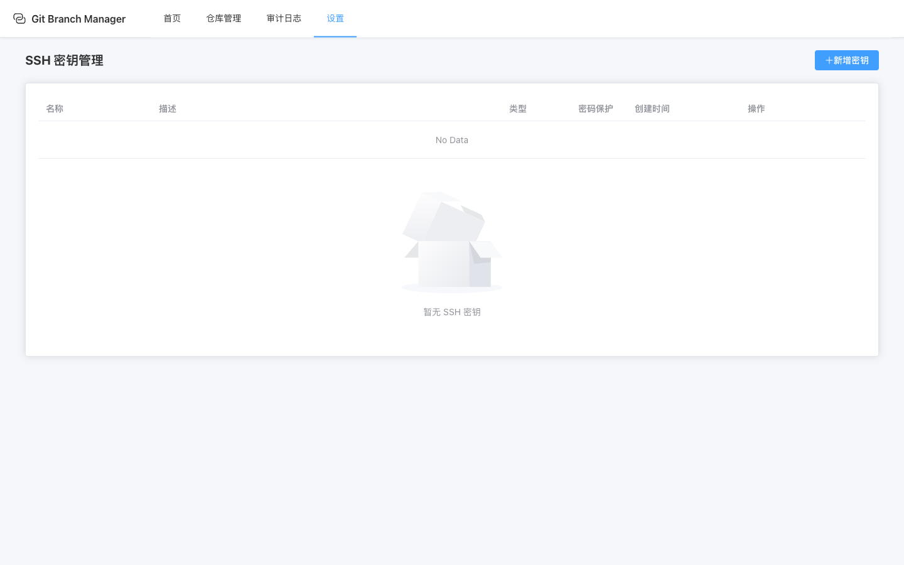
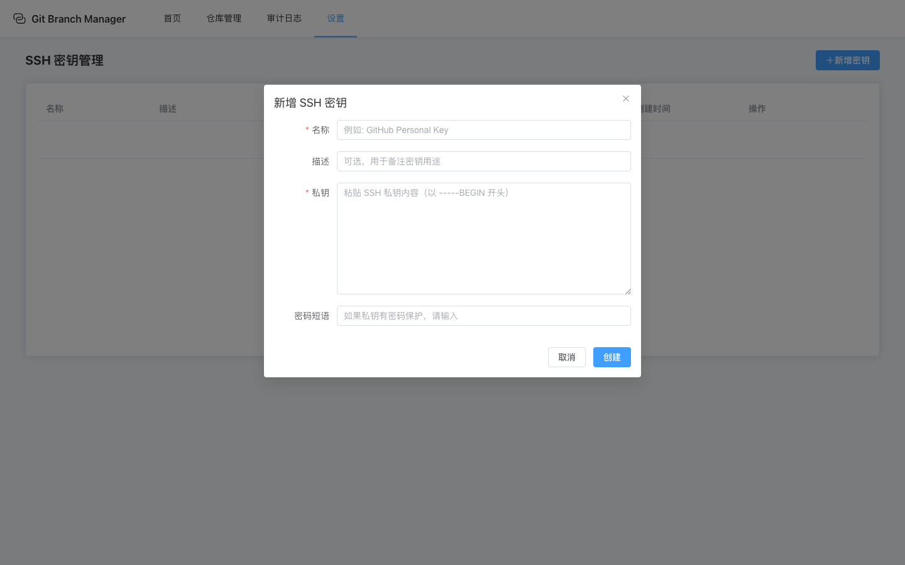

# Git Manage Service (Git 管理服务)

Git Manage Service 是一个轻量级的多仓库、多分支自动化同步管理系统。它提供了友好的 Web 界面，支持定时任务、Webhook 触发、多渠道消息通知以及详细的同步日志记录。



## 功能特性

- **多仓库管理** - 轻松注册和管理本地 Git 仓库
- **灵活同步规则** - 支持任意 Remote 和分支之间的同步（如 `origin/main` -> `backup/main`）
- **自动化执行** - 内置 Cron 调度器，支持定时同步
- **Webhook 集成** - 支持通过外部系统（如 CI/CD）触发同步
- **安全可靠** - 冲突检测、Fast-Forward 检查及 Force Push 保护
- **多渠道通知** - 支持钉钉、企业微信、飞书、蓝信、邮件、自定义 Webhook，按事件类型和自定义模板发送通知
- **消息模板** - 支持 Go 模板语法 `{{.Var}}`，支持渠道级和事件级两层模板配置
- **SSH 密钥管理** - 支持将 SSH 密钥存储在数据库中，统一管理仓库认证
- **多数据库支持** - 支持 SQLite（默认）、MySQL、PostgreSQL
- **高可用存储** - 可选 MinIO 对象存储，支持分布式 Redis 锁
- **代码质量分析** - 集成 lint 规则，提供代码质量检查
- **可视化界面** - 提供直观的 Web UI，查看历史、日志及管理任务
- **RPC 服务** - 提供 Kitex RPC 接口，支持服务间调用

## 界面预览

### 首页


### 仓库管理

仓库列表页面，支持注册现有仓库或克隆新仓库：


注册仓库弹窗：



### 仓库详情

展示仓库基本信息、远程配置和分支追踪：



Git 有效提交度量页面，提供贡献者排行、提交趋势、文件类型分布等分析：


真实工程代码度量页面，基于 git blame 分析代码归属，统计代码行数、注释行数、空白行数等：



### 分支管理

查看所有本地和远程分支，支持切换、推送、拉取等操作：


### 同步任务

创建和管理同步规则，支持单分支和全分支同步模式：


新建同步规则：



### 版本历史

管理 Git 标签（Tag），支持创建、推送、删除标签：



### 文件浏览

浏览仓库文件结构，支持查看文件内容和历史：



### 审计日志

记录所有操作日志，支持按类型、对象、时间筛选：


### 系统设置

系统设置页面，包含 SSH 密钥管理、通知渠道管理、全局 Git 配置等：


### SSH 密钥管理

管理用于 Git 仓库认证的 SSH 密钥：



新增 SSH 密钥：



### 通知渠道配置

配置通知渠道，支持 8 种触发事件和自定义消息模板：


使用 Go 模板语法 `{{.Var}}`，提供 17 个模板变量。支持两层模板配置：渠道级默认模板 + 事件级独立模板，事件级模板优先级更高，留空则回退到渠道级模板。

可用模板变量：

| 变量 | 说明 | 适用事件 |
|------|------|----------|
| `{{.TaskKey}}` | 任务标识 | 全部 |
| `{{.Status}}` | 状态码 (success/failure) | 全部 |
| `{{.StatusText}}` | 状态文字 (成功/失败) | 全部 |
| `{{.EventType}}` | 事件类型 | 全部 |
| `{{.EventLabel}}` | 事件名称 | 全部 |
| `{{.Timestamp}}` | 时间 | 全部 |
| `{{.SourceRemote}}` | 源远程仓库 | 同步事件 |
| `{{.SourceBranch}}` | 源分支 | 同步事件 |
| `{{.TargetRemote}}` | 目标远程仓库 | 同步事件 |
| `{{.TargetBranch}}` | 目标分支 | 同步事件 |
| `{{.RepoKey}}` | 仓库标识 | 全部 |
| `{{.ErrorMessage}}` | 错误信息 | 失败/错误/冲突 |
| `{{.CommitRange}}` | 提交范围 | 同步成功 |
| `{{.Duration}}` | 执行耗时 | 同步/备份 |
| `{{.CronExpression}}` | Cron 表达式 | 定时任务 |
| `{{.WebhookSource}}` | Webhook 来源 | Webhook 事件 |
| `{{.BackupPath}}` | 备份路径 | 备份事件 |

**模板示例：**
```
标题：[{{.StatusText}}] {{.TaskKey}} 同步通知
内容：任务 {{.TaskKey}} 于 {{.Timestamp}} 执行{{.StatusText}}
      {{.SourceRemote}}/{{.SourceBranch}} -> {{.TargetRemote}}/{{.TargetBranch}}
      耗时: {{.Duration}}
      {{if .ErrorMessage}}错误: {{.ErrorMessage}}{{end}}
```

## 文档

- [产品手册与使用说明](docs/product_manual.md)
- [Webhook 接口文档](docs/webhook.md)

## 快速开始

### 方式一：下载预编译二进制文件（推荐）

从 [Releases](https://github.com/yi-nology/git-manage-service/releases) 页面下载适合你系统的版本：

- **Linux (AMD64)**: `git-manage-service-linux-amd64.tar.gz`
- **Linux (ARM64)**: `git-manage-service-linux-arm64.tar.gz`
- **macOS (Intel)**: `git-manage-service-darwin-amd64.tar.gz`
- **macOS (Apple Silicon)**: `git-manage-service-darwin-arm64.tar.gz`
- **Windows (AMD64)**: `git-manage-service-windows-amd64.exe.zip`
- **Windows (ARM64)**: `git-manage-service-windows-arm64.exe.zip`

#### Linux / macOS
```bash
# 解压
tar -xzf git-manage-service-*.tar.gz

# 添加执行权限
chmod +x git-manage-service-*

# 运行
./git-manage-service-*
```

#### Windows
```powershell
# 解压 zip 文件
# 双击运行或在命令行中执行
.it-manage-service-windows-amd64.exe
```

### 方式二：Docker Compose 部署

项目提供三种数据库方案的 Docker Compose 配置：

```bash
# SQLite（默认，最简单）
cd deploy/docker-compose/sqlite
docker-compose up -d

# MySQL（带 Redis + MinIO）
cd deploy/docker-compose/mysql
docker-compose up -d

# PostgreSQL（带 Redis + MinIO）
cd deploy/docker-compose/postgres
docker-compose up -d
```

> SQLite 方案适合单机部署，MySQL/PostgreSQL 方案带有 Redis 分布式锁和 MinIO 对象存储，适合高可用场景。

### 方式三：从源码编译
```bash
# 安装依赖
go mod tidy

# 编译前端
cd frontend && npm install && npm run build && cd ..

# 复制前端到 public 目录
cp -r frontend/dist public

# 编译
go build -o git-manage-service main.go

# 运行
./git-manage-service
```

### 访问界面
浏览器打开: [http://localhost:38080](http://localhost:38080)

### 查看版本信息
```bash
./git-manage-service --version
```

### 启动模式

项目支持三种启动模式：

```bash
# 仅启动 HTTP 服务
./git-manage-service --mode=http

# 仅启动 RPC 服务
./git-manage-service --mode=rpc

# 同时启动 HTTP 和 RPC 服务（默认）
./git-manage-service --mode=all
```

## 项目结构
```
.
├── biz/              # 业务逻辑 (Service, Handler, Model)
│   ├── handler/      # HTTP 请求处理
│   ├── service/      # 核心业务服务
│   │   ├── notification/  # 通知服务（模板引擎、多渠道发送）
│   │   ├── sync/          # 同步服务
│   │   ├── git/           # Git 操作封装
│   │   ├── audit/          # 审计服务
│   │   └── stats/          # 统计服务
│   ├── model/        # 数据模型 (PO, API, Proto)
│   ├── dal/          # 数据访问层
│   │   └── db/            # 数据库操作
│   ├── router/       # 路由注册
│   └── rpc_handler/  # RPC 服务处理
├── pkg/              # 公共库
│   ├── appinfo/      # 应用信息
│   ├── configs/      # 配置管理
│   ├── storage/      # 存储抽象层 (本地/MinIO)
│   ├── lock/         # 分布式锁 (内存/Redis)
│   └── logger/       # 日志管理
├── frontend/         # Vue 3 + Element Plus 前端
├── deploy/           # 部署配置 (Docker Compose, K8s)
├── docs/             # 项目文档
├── idl/              # Proto 接口定义
├── main.go           # 入口文件
└── go.mod            # Go 依赖定义
```

## 技术栈

### 后端
- **语言**: Go 1.25.0
- **Web 框架**: CloudWeGo Hertz
- **RPC 框架**: CloudWeGo Kitex
- **数据库**: SQLite, MySQL, PostgreSQL
- **缓存**: Redis (可选)
- **对象存储**: MinIO (可选)
- **Git 操作**: go-git
- **配置管理**: Viper
- **日志**: Logrus
- **Cron 调度**: robfig/cron

### 前端
- **框架**: Vue 3
- **UI 库**: Element Plus
- **状态管理**: Pinia
- **路由**: Vue Router
- **HTTP 客户端**: Axios
- **图表**: ECharts
- **代码编辑器**: Monaco Editor
- **差异对比**: diff2html
- **构建工具**: Vite
- **语言**: TypeScript

## 配置说明

项目支持通过配置文件和环境变量进行配置。默认配置文件路径为 `./conf/config.yaml`。

### 主要配置项

```yaml
# 服务器配置
server:
  port: 38080

# RPC 服务配置
rpc:
  port: 8888

# 数据库配置
database:
  type: sqlite  # 可选: sqlite, mysql, postgres
  path: data.db  # SQLite 数据库路径
  # MySQL/PostgreSQL 配置
  host: localhost
  port: 3306
  user: root
  password: password
  dbname: git_manage_service

# Webhook 配置
webhook:
  secret: my-secret-key
  rate_limit: 100
  ip_whitelist: []

# 存储配置
storage:
  type: local  # 可选: local, minio
  local_path: ./data
  # MinIO 配置
  endpoint: localhost:9000
  access_key: minioadmin
  secret_key: minioadmin
  use_ssl: false
  repo_bucket: git-repos
  ssh_key_bucket: ssh-keys
  audit_log_bucket: audit-logs
  backup_bucket: backups

# 分布式锁配置
lock:
  type: memory  # 可选: memory, redis
  # Redis 配置
  redis_addr: localhost:6379
  redis_password: ""
  redis_db: 0

# 代码质量检查配置
lint:
  enable_rpmlint: false
```

### 环境变量

| 环境变量 | 说明 | 默认值 |
|---------|------|--------|
| WEBHOOK_SECRET | Webhook 密钥 | my-secret-key |
| DB_PATH | SQLite 数据库路径 | data.db |

## 开发者指南

### Hz IDL 约束使用方法

本项目使用 CloudWeGo Hertz 框架的 Hz 工具来约束 IDL 定义，确保所有 HTTP 接口都通过 IDL 进行规范化管理。

#### 代码生成流程

1. **更新 IDL 文件**
   - IDL 文件位于 `idl/` 目录下
   - 编辑相应的 proto 文件来定义或修改 HTTP 接口

2. **运行代码生成脚本**
```bash
# 执行代码生成脚本
./script/gen.sh
```

3. **生成的代码结构**
   - 生成的代码位于 `biz/model/hz/` 目录下
   - 包括路由注册和处理器结构

4. **集成路由**
   - 路由已自动集成到 `biz/router/register.go` 中
   - 使用 `hz.GeneratedRegister()` 注册所有生成的路由

5. **实现处理器**
   - 处理器实现位于 `biz/handler/hz/` 目录下
   - 按照生成的结构实现具体的业务逻辑

#### 注意事项

- 所有 HTTP 接口必须在 IDL 文件中定义
- 使用 Hz 生成的结构进行请求和响应处理
- 保持字段名和类型与 IDL 定义一致
- 定期运行代码生成脚本以保持代码同步

### 创建新版本发布

本项目使用 GitHub Actions 自动构建多平台二进制文件。要创建新的发布版本：

1. **创建版本标签**
```bash
# 创建并推送标签
git tag -a v1.0.0 -m "Release version 1.0.0"
git push origin v1.0.0
```

2. **自动构建**
   - GitHub Actions 会自动检测到标签推送
   - 自动构建 6 个平台的二进制文件：
     - Linux (AMD64/ARM64)
     - macOS (Intel/Apple Silicon)
     - Windows (AMD64/ARM64)
   - 自动创建 GitHub Release 并上传构建产物

3. **手动触发**（可选）
   - 访问 GitHub Actions 页面
   - 选择 "Release Build" 工作流
   - 点击 "Run workflow" 按钮手动触发

### 本地构建多平台版本

```bash
# Linux AMD64
GOOS=linux GOARCH=amd64 go build -o git-manage-service-linux-amd64 main.go

# Linux ARM64
GOOS=linux GOARCH=arm64 go build -o git-manage-service-linux-arm64 main.go

# macOS AMD64
GOOS=darwin GOARCH=amd64 go build -o git-manage-service-darwin-amd64 main.go

# macOS ARM64
GOOS=darwin GOARCH=arm64 go build -o git-manage-service-darwin-arm64 main.go

# Windows AMD64
GOOS=windows GOARCH=amd64 go build -o git-manage-service-windows-amd64.exe main.go

# Windows ARM64
GOOS=windows GOARCH=arm64 go build -o git-manage-service-windows-arm64.exe main.go
```

## License
MIT