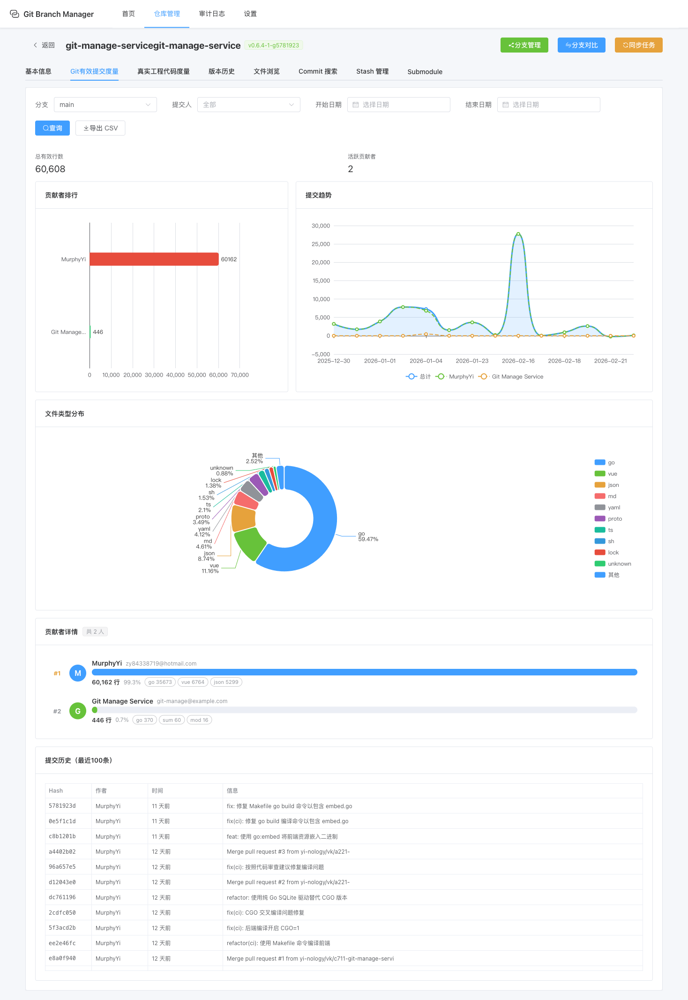

# Git Manage Service

<p align="center">
  
</p>

<p align="center">
  <strong>轻量级多仓库自动化同步管理系统</strong>
</p>

<p align="center">
  <a href="https://github.com/yi-nology/git-manage-service/releases">
    
  </a>
  <a href="https://github.com/yi-nology/git-manage-service/blob/main/LICENSE">
    
  </a>
  <a href="https://github.com/yi-nology/git-manage-service/actions">
    
  </a>
</p>

---

## ✨ 功能特性

| 功能 | 说明 |
|------|------|
| 📦 **多仓库管理** | 轻松注册和管理本地 Git 仓库 |
| 🔄 **灵活同步规则** | 支持任意 Remote 和分支之间的同步 |
| ⏰ **自动化执行** | 内置 Cron 调度器，支持定时同步 |
| 🔔 **多渠道通知** | 钉钉、企微、飞书、邮件、自定义 Webhook |
| 🔐 **SSH 密钥管理** | 统一管理 SSH 密钥，安全访问私有仓库 |
| 📊 **代码度量** | 提交统计、贡献者排行、代码质量分析 |
| 🔌 **Webhook 集成** | 支持外部系统触发同步 |
| 📝 **审计日志** | 完整的操作日志记录 |

## 🚀 快速开始

### 下载安装

从 [Releases](https://github.com/yi-nology/git-manage-service/releases) 下载适合你系统的版本：

```bash
# macOS Apple Silicon
wget https://github.com/yi-nology/git-manage-service/releases/download/v0.7.2/git-manage-service-darwin-arm64.tar.gz

# Linux AMD64
wget https://github.com/yi-nology/git-manage-service/releases/download/v0.7.2/git-manage-service-linux-amd64.tar.gz
```

### 运行服务

```bash
# 解压
tar -xzf git-manage-service-*.tar.gz

# 运行
./git-manage-service

# 访问
open http://localhost:38080
```

### Docker 部署

```bash
docker run -d \
  --name git-manage-service \
  -p 38080:38080 \
  -v $(pwd)/data:/app/data \
  ghcr.io/yi-nology/git-manage-service:latest
```

## 📖 文档

| 文档 | 说明 |
|------|------|
| [快速开始](docs/getting-started.md) | 5 分钟完成安装和配置 |
| [功能指南](docs/README.md) | 详细的功能使用说明 |
| [部署方案](docs/deployment/binary.md) | 生产环境部署指南 |
| [配置参考](docs/configuration.md) | 完整的配置项说明 |
| [API 文档](docs/api.md) | HTTP API 接口参考 |
| [Webhook 集成](docs/features/webhook.md) | 外部触发同步 |

## 🛠 技术栈

| 后端 | 前端 |
|------|------|
| Go 1.25 | Vue 3 |
| CloudWeGo Hertz | Element Plus |
| CloudWeGo Kitex | Pinia |
| SQLite / MySQL / PostgreSQL | ECharts |
| Redis (可选) | Monaco Editor |
| MinIO (可选) | TypeScript |

## 📸 界面预览

| 仓库管理 | 分支操作 |
|:---:|:---:|
|  |  |

| 同步任务 | 代码度量 |
|:---:|:---:|
|  |  |

更多截图请查看 [文档](docs/README.md)。

## 🔧 开发

### 环境要求

- Go 1.25+
- Node.js 18+
- npm 或 yarn

### 本地开发

```bash
# 克隆仓库
git clone https://github.com/yi-nology/git-manage-service.git
cd git-manage-service

# 安装依赖
go mod tidy
cd frontend && npm install && cd ..

# 开发模式运行
make run

# 或完整构建
make build-full
```

### 构建发布

```bash
# 创建版本标签
git tag -a v1.0.0 -m "Release version 1.0.0"
git push origin v1.0.0

# GitHub Actions 会自动构建并发布
```

## 🤝 参与贡献

欢迎提交 Issue 和 Pull Request！

1. Fork 本仓库
2. 创建特性分支 (`git checkout -b feature/amazing-feature`)
3. 提交更改 (`git commit -m 'Add amazing feature'`)
4. 推送到分支 (`git push origin feature/amazing-feature`)
5. 创建 Pull Request

## 📄 许可证

本项目基于 [MIT](LICENSE) 许可证开源。

## 🔗 相关链接

- **GitHub**: [yi-nology/git-manage-service](https://github.com/yi-nology/git-manage-service)
- **Issues**: [问题反馈](https://github.com/yi-nology/git-manage-service/issues)
- **Releases**: [版本下载](https://github.com/yi-nology/git-manage-service/releases)
- **文档**: [在线文档](https://yi-nology.github.io/git-manage-service/)

---

<p align="center">
  如果这个项目对你有帮助，请给一个 ⭐️ Star 支持一下！
</p>
