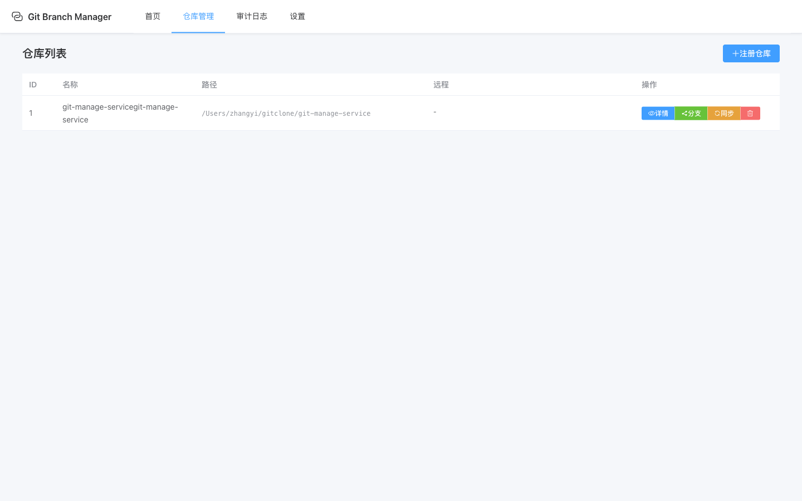
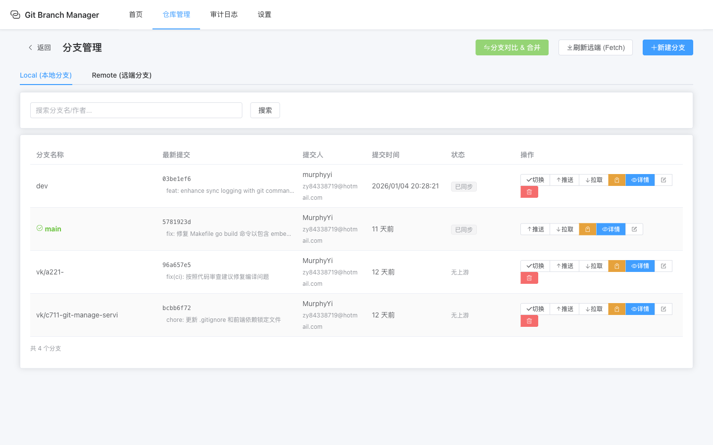
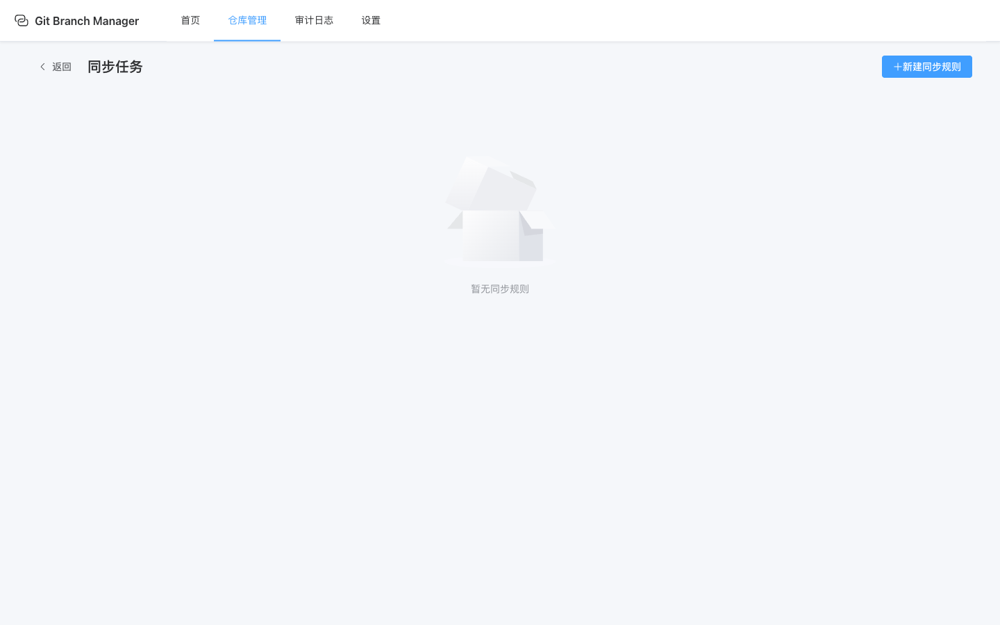
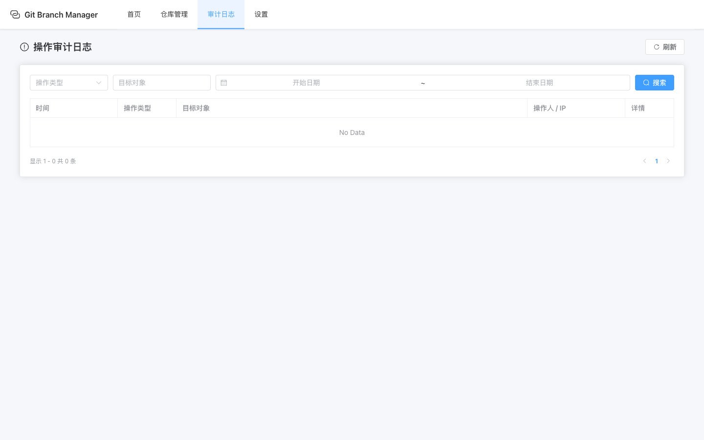
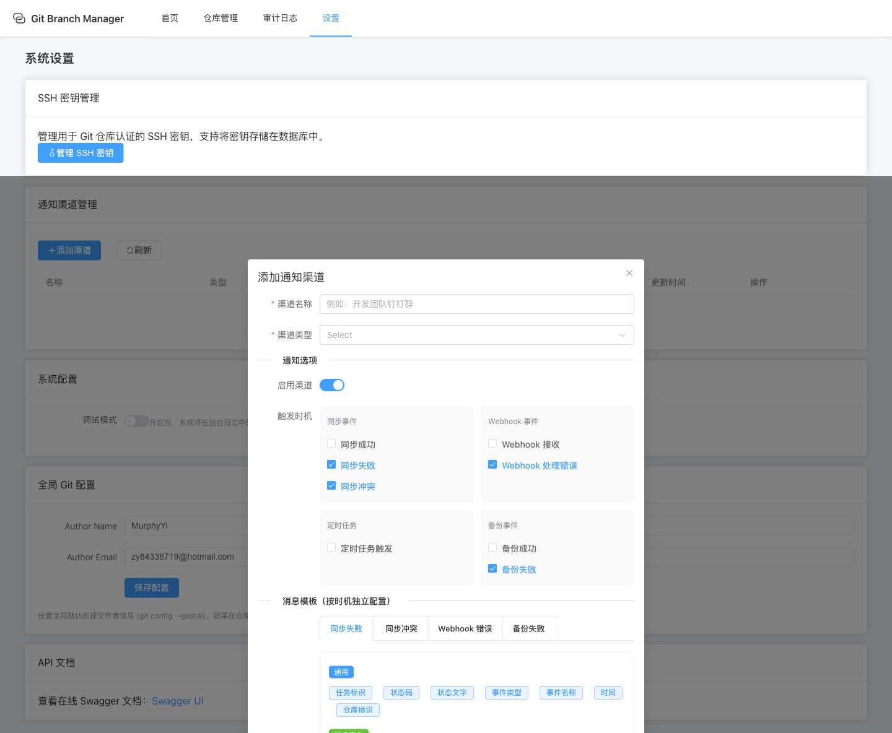

## 🚀 功能亮点

<div class="features-grid">

### 仓库管理


支持注册现有仓库或克隆远程仓库，一键管理所有本地 Git 仓库。

### 分支操作


直观的分支管理界面，支持切换、推送、拉取、合并等操作。

### 同步任务


创建灵活的同步规则，支持单分支和全分支同步模式。

### 代码度量


提供贡献者排行、提交趋势、文件类型分布等分析。

### 审计日志


完整记录所有操作日志，支持按类型、对象、时间筛选。

### 通知配置


配置多种通知渠道，支持 8 种触发事件和自定义消息模板。

</div>

## 📋 快速开始

### 下载安装

从 [Releases](https://github.com/yi-nology/git-manage-service/releases) 下载适合你系统的版本：

| 平台 | 架构 | 下载 |
|------|------|------|
| Linux | AMD64 / ARM64 | `git-manage-service-linux-*.tar.gz` |
| macOS | Intel / Apple Silicon | `git-manage-service-darwin-*.tar.gz` |
| Windows | AMD64 / ARM64 | `git-manage-service-windows-*.exe.zip` |

### 启动服务

```bash
# 解压
tar -xzf git-manage-service-*.tar.gz

# 运行
./git-manage-service

# 访问 Web 界面
open http://localhost:38080
```

### Docker 部署

```bash
# SQLite（最简单）
cd deploy/docker-compose/sqlite
docker-compose up -d
```

## 🛠 技术栈

| 后端 | 前端 |
|------|------|
| Go 1.25 | Vue 3 |
| CloudWeGo Hertz | Element Plus |
| CloudWeGo Kitex | Pinia |
| SQLite / MySQL / PostgreSQL | ECharts |
| Redis (可选) | Monaco Editor |
| MinIO (可选) | TypeScript |

## 📖 文档导航

- [使用指南](/usage) - 详细的功能使用说明
- [部署指南](/deployment) - 生产环境部署方案
- [产品手册](/product_manual) - 完整的产品手册
- [Webhook 接口](/webhook) - Webhook 集成文档

## 🤝 参与贡献

项目开源在 [GitHub](https://github.com/yi-nology/git-manage-service)，欢迎 Star ⭐️ 和 PR！

<style>
.features-grid {
  display: grid;
  grid-template-columns: repeat(2, 1fr);
  gap: 20px;
  margin-top: 20px;
}

.features-grid img {
  max-width: 100%;
  border-radius: 8px;
  box-shadow: 0 2px 12px rgba(0,0,0,0.1);
  margin: 10px 0;
}

@media (max-width: 768px) {
  .features-grid {
    grid-template-columns: 1fr;
  }
}
</style>
