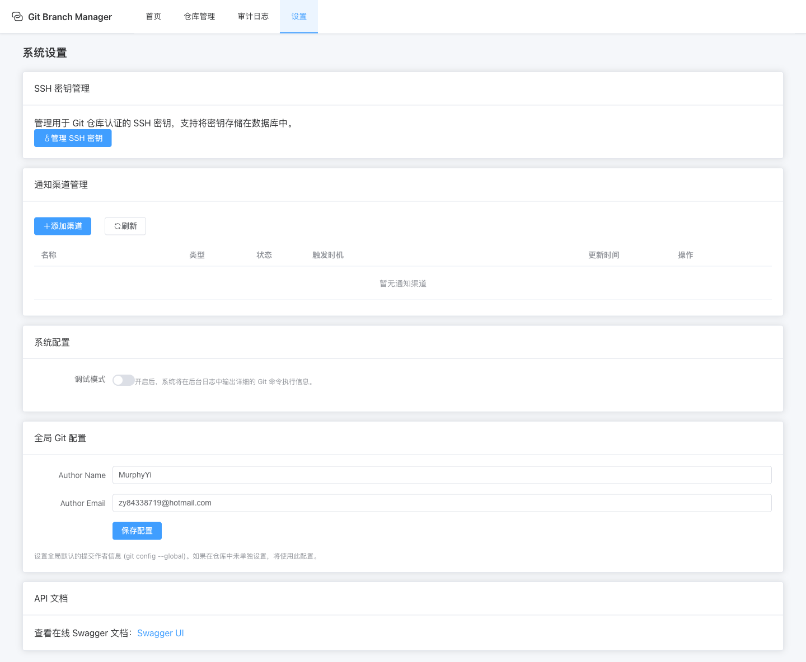

# 部署指南

## 1. 部署方式



Git Manage Service 支持多种部署方式，您可以根据自己的需求选择最合适的方式。

### 1.1 预编译二进制文件（推荐）

从 [Releases](https://github.com/yi-nology/git-manage-service/releases) 页面下载适合你系统的版本：

- **Linux (AMD64)**: `git-manage-service-linux-amd64.tar.gz`
- **Linux (ARM64)**: `git-manage-service-linux-arm64.tar.gz`
- **macOS (Intel)**: `git-manage-service-darwin-amd64.tar.gz`
- **macOS (Apple Silicon)**: `git-manage-service-darwin-arm64.tar.gz`
- **Windows (AMD64)**: `git-manage-service-windows-amd64.exe.zip`
- **Windows (ARM64)**: `git-manage-service-windows-arm64.exe.zip`

#### Linux / macOS

```bash
# 解压
tar -xzf git-manage-service-*.tar.gz

# 添加执行权限
chmod +x git-manage-service-*

# 运行
./git-manage-service-*
```

#### Windows

```powershell
# 解压 zip 文件
# 双击运行或在命令行中执行
./git-manage-service-windows-amd64.exe
```

### 1.2 Docker Compose 部署

项目提供三种数据库方案的 Docker Compose 配置：

#### SQLite 方案（默认，最简单）

```bash
cd deploy/docker-compose/sqlite
docker-compose up -d
```

#### MySQL 方案（带 Redis + MinIO）

```bash
cd deploy/docker-compose/mysql
docker-compose up -d
```

#### PostgreSQL 方案（带 Redis + MinIO）

```bash
cd deploy/docker-compose/postgres
docker-compose up -d
```

> SQLite 方案适合单机部署，MySQL/PostgreSQL 方案带有 Redis 分布式锁和 MinIO 对象存储，适合高可用场景。

### 1.3 从源码编译

```bash
# 安装依赖
go mod tidy

# 编译前端
cd frontend && npm install && npm run build && cd ..

# 复制前端到 public 目录
cp -r frontend/dist public

# 编译
go build -o git-manage-service main.go

# 运行
./git-manage-service
```

### 1.4 Kubernetes 部署

项目提供了 Kubernetes 部署配置，位于 `deploy/k8s/` 目录。

#### 准备工作

1. 确保您已经安装了 Kubernetes 集群
2. 确保您已经安装了 `kubectl` 命令行工具
3. 确保您已经配置了 `kubectl` 连接到您的 Kubernetes 集群

#### 部署步骤

```bash
cd deploy/k8s

# 修改配置文件（可选）
# 编辑 configmap.yaml 和 secret.yaml 文件，根据您的环境修改配置

# 运行部署脚本
./deploy.sh
```

## 2. 配置说明

项目支持通过配置文件和环境变量进行配置。默认配置文件路径为 `./conf/config.yaml`。

### 2.1 配置文件

```yaml
# 服务器配置
server:
  port: 38080

# RPC 服务配置
rpc:
  port: 8888

# 数据库配置
database:
  type: sqlite  # 可选: sqlite, mysql, postgres
  path: data.db  # SQLite 数据库路径
  # MySQL/PostgreSQL 配置
  host: localhost
  port: 3306
  user: root
  password: password
  dbname: git_manage_service

# Webhook 配置
webhook:
  secret: my-secret-key
  rate_limit: 100
  ip_whitelist: []

# 存储配置
storage:
  type: local  # 可选: local, minio
  local_path: ./data
  # MinIO 配置
  endpoint: localhost:9000
  access_key: minioadmin
  secret_key: minioadmin
  use_ssl: false
  repo_bucket: git-repos
  ssh_key_bucket: ssh-keys
  audit_log_bucket: audit-logs
  backup_bucket: backups

# 分布式锁配置
lock:
  type: memory  # 可选: memory, redis
  # Redis 配置
  redis_addr: localhost:6379
  redis_password: ""
  redis_db: 0

# 代码质量检查配置
lint:
  enable_rpmlint: false
```

### 2.2 环境变量

| 环境变量 | 说明 | 默认值 |
|---------|------|--------|
| WEBHOOK_SECRET | Webhook 密钥 | my-secret-key |
| DB_PATH | SQLite 数据库路径 | data.db |
| DB_TYPE | 数据库类型 (sqlite, mysql, postgres) | sqlite |
| DB_HOST | 数据库主机 | localhost |
| DB_PORT | 数据库端口 | 3306 (MySQL), 5432 (PostgreSQL) |
| DB_USER | 数据库用户名 | root |
| DB_PASSWORD | 数据库密码 | password |
| DB_NAME | 数据库名称 | git_manage_service |
| SERVER_PORT | HTTP 服务端口 | 38080 |
| RPC_PORT | RPC 服务端口 | 8888 |
| STORAGE_TYPE | 存储类型 (local, minio) | local |
| STORAGE_LOCAL_PATH | 本地存储路径 | ./data |
| LOCK_TYPE | 锁类型 (memory, redis) | memory |

## 3. 启动模式

项目支持三种启动模式：

```bash
# 仅启动 HTTP 服务
./git-manage-service --mode=http

# 仅启动 RPC 服务
./git-manage-service --mode=rpc

# 同时启动 HTTP 和 RPC 服务（默认）
./git-manage-service --mode=all
```

## 4. 多平台构建

### 4.1 本地构建

```bash
# Linux AMD64
GOOS=linux GOARCH=amd64 go build -o git-manage-service-linux-amd64 main.go

# Linux ARM64
GOOS=linux GOARCH=arm64 go build -o git-manage-service-linux-arm64 main.go

# macOS AMD64
GOOS=darwin GOARCH=amd64 go build -o git-manage-service-darwin-amd64 main.go

# macOS ARM64
GOOS=darwin GOARCH=arm64 go build -o git-manage-service-darwin-arm64 main.go

# Windows AMD64
GOOS=windows GOARCH=amd64 go build -o git-manage-service-windows-amd64.exe main.go

# Windows ARM64
GOOS=windows GOARCH=arm64 go build -o git-manage-service-windows-arm64.exe main.go
```

### 4.2 GitHub Actions 自动构建

本项目使用 GitHub Actions 自动构建多平台二进制文件。要创建新的发布版本：

1. **创建版本标签**

```bash
# 创建并推送标签
git tag -a v1.0.0 -m "Release version 1.0.0"
git push origin v1.0.0
```

2. **自动构建**
   - GitHub Actions 会自动检测到标签推送
   - 自动构建 6 个平台的二进制文件：
     - Linux (AMD64/ARM64)
     - macOS (Intel/Apple Silicon)
     - Windows (AMD64/ARM64)
   - 自动创建 GitHub Release 并上传构建产物

3. **手动触发**（可选）
   - 访问 GitHub Actions 页面
   - 选择 "Release Build" 工作流
   - 点击 "Run workflow" 按钮手动触发

## 5. 高可用部署

### 5.1 数据库选择

对于高可用部署，建议使用 MySQL 或 PostgreSQL 数据库，而非 SQLite。

### 5.2 存储配置

对于高可用部署，建议使用 MinIO 对象存储，而非本地存储。

### 5.3 分布式锁

对于高可用部署，建议使用 Redis 分布式锁，而非内存锁。

### 5.4 负载均衡

对于高可用部署，建议在多个实例前配置负载均衡器，如 Nginx 或 Kubernetes Ingress。

## 6. 安全配置

### 6.1 防火墙设置

确保只开放必要的端口：
- HTTP 服务端口：38080
- RPC 服务端口：8888（仅当需要 RPC 服务时）

### 6.2 HTTPS 配置

对于生产环境，建议配置 HTTPS。您可以使用 Nginx 或其他反向代理来实现 HTTPS。

### 6.3 认证与授权

- **Webhook 密钥**：设置强密码作为 Webhook 密钥，避免未授权访问。
- **IP 白名单**：如需限制 Webhook 访问来源，可配置 IP 白名单。
- **SSH 密钥管理**：使用系统提供的 SSH 密钥管理功能，避免在配置文件中明文存储密钥。

## 7. 监控与日志

### 7.1 日志配置

项目使用 Logrus 进行日志记录，默认日志级别为 info。您可以通过环境变量 `LOG_LEVEL` 来修改日志级别：

```bash
# 设置日志级别为 debug
export LOG_LEVEL=debug
./git-manage-service
```

### 7.2 监控集成

对于生产环境，建议集成监控系统，如 Prometheus 和 Grafana，以监控系统的运行状态。

## 8. 升级指南

### 8.1 二进制文件升级

1. 下载新版本的二进制文件
2. 停止当前运行的服务
3. 替换二进制文件
4. 启动服务

### 8.2 Docker Compose 升级

1. 停止当前运行的容器

```bash
docker-compose down
```

2. 拉取最新的镜像或更新 Dockerfile

3. 重新启动容器

```bash
docker-compose up -d
```

### 8.3 数据库迁移

项目会自动处理数据库迁移，升级时无需手动执行迁移命令。

## 9. 故障排查

### 9.1 常见问题

#### 服务启动失败

- **检查端口占用**：确保系统使用的端口（默认 38080）未被其他进程占用。
- **检查配置文件**：确保配置文件格式正确，且所有必要的配置项都已设置。
- **检查数据库**：确保数据库连接正常，且有足够的权限。

#### 同步任务失败

- **检查网络连接**：确保服务器能够访问远程仓库。
- **检查权限**：确保服务器有足够的权限访问和修改仓库。
- **检查 SSH 密钥**：确保 SSH 密钥配置正确，且有权限访问远程仓库。
- **查看日志**：查看同步任务的详细日志，了解失败原因。

#### 通知发送失败

- **检查渠道配置**：确保通知渠道的配置信息正确。
- **检查网络连接**：确保服务器能够访问通知服务的 API。
- **查看日志**：查看通知发送的详细日志，了解失败原因。

### 9.2 日志查看

```bash
# 查看系统日志
./git-manage-service --mode=http > service.log 2>&1

# 查看同步任务日志
# 日志文件位于 ./data/logs/ 目录下
```

## 10. 最佳实践

### 10.1 生产环境配置

- **数据库**：使用 MySQL 或 PostgreSQL 数据库。
- **存储**：使用 MinIO 对象存储。
- **分布式锁**：使用 Redis 分布式锁。
- **HTTPS**：配置 HTTPS。
- **监控**：集成监控系统。
- **备份**：定期备份数据库和存储数据。

### 10.2 性能优化

- **仓库数量**：建议不要注册过多仓库，以免影响系统性能。
- **同步频率**：根据代码变更频率设置合理的同步频率，避免过于频繁的同步。
- **数据库索引**：确保数据库表有适当的索引。
- **内存配置**：根据服务器配置调整 Go 程序的内存使用。

### 10.3 安全最佳实践

- **最小权限原则**：为服务设置最小必要的权限。
- **定期更新**：定期更新服务版本，修复安全漏洞。
- **密钥管理**：使用安全的方式管理密钥和凭证。
- **审计日志**：启用审计日志，记录所有操作。